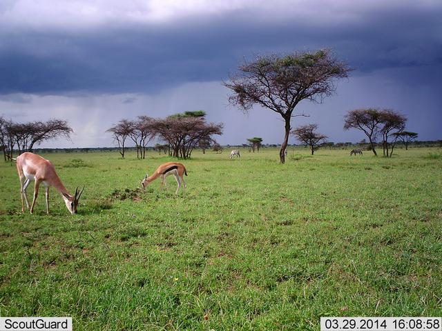

# Deep Learning wildlife classifier - try it yourself

</img> 
<em>In this image our model correctly recognizes the Grant's gazelle, a Thomson's gazelle, and the zebras in the back</em>

Try our model on your own images - check if it can spot any of the 53 species from Serengeti in any of your favourite photos.

To play with it you need to:
 - clone the repo, 
 - place the images you want to classify in the /images folder (only JPEGs and PNGs are supported)
 - run the classify_images notebook! (make sure you have all the necessary libraries installed)

We have trained the model and used it to obtain 5th place in the <a href="https://www.drivendata.org/competitions/59/camera-trap-serengeti/">Hakuna Ma-data competition</a>.

Note: 
The classes our model is trained to recognize are:
aardvark, aardwolf, baboon, bat, batearedfox, buffalo, bushbuck, caracal, cattle, cheetah, civet, dikdik, duiker, eland, elephant, empty, gazellegrants, gazellethomsons, genet, giraffe, guineafowl, hare, hartebeest, hippopotamus, honeybadger, hyenaspotted, hyenastriped, impala, insectspider, jackal, koribustard,leopard, lionfemale, lionmale, mongoose, monkeyvervet, ostrich, otherbird, porcupine, reedbuck, reptiles, rhinoceros, rodents, secretarybird, serval, steenbok, topi,vulture, warthog, waterbuck, wildcat, wildebeest, zebra, zorilla
